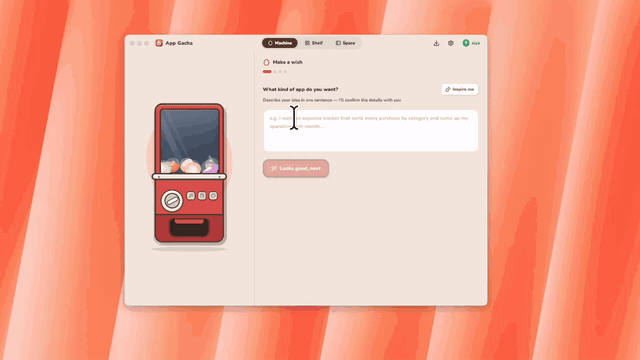
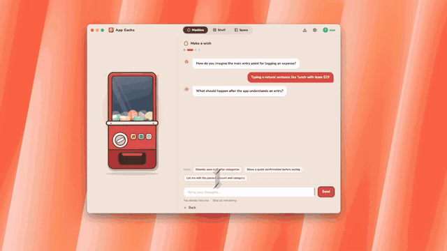
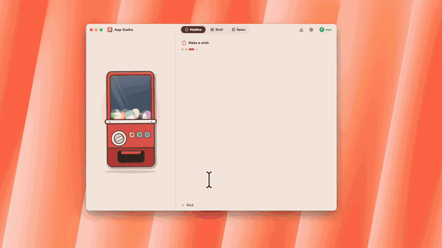

<p align="center">
  <picture>
    <source media="(prefers-color-scheme: dark)" srcset="assets/readme/appgacha-wordmark-dark.png" />
    
  </picture>
</p>

<h3 align="center">Turn a sentence into your own tiny desktop app.</h3>

<p align="center">
  An open-source AI app builder for Windows and macOS.<br />
  Describe an idea. Open your capsule. Make it part of your day.
</p>

<p align="center">
  <a href="README.md">English</a> · <a href="README.zh-CN.md">简体中文</a>
</p>

<p align="center">
  <a href="https://github.com/zaziax/appGacha/releases/latest"></a>
  <a href="LICENSE"></a>
  
  
</p>

<p align="center">
  <a href="https://appgacha.com/#download"><strong>Download AppGacha</strong></a> ·
  <a href="https://github.com/zaziax/appGacha/releases">Releases</a> ·
  <a href="docs/mcp.md">MCP setup</a> ·
  <a href="https://github.com/zaziax/appGacha/issues">Feedback</a>
</p>


<p align="center">
  <a href="https://youtu.be/IcDF_kpP8BM"><strong>Watch the product film on YouTube →</strong></a><br />
  <sub>An animated tour of AppGacha, from an idea to your desktop workspace.</sub>
</p>

## Small apps, made for you

A notes app that fits the way you think. A timer that stays on your desktop. A personal expense tracker, a workout log, or a tiny game.

AppGacha turns a plain-language request into a **capsule**: a small HTML/CSS/JavaScript app that runs inside AppGacha's desktop runtime, with its own local data. No development environment is needed to use the downloaded app.

- **Build by describing.** Refine your request, then let AI create and check the app.
- **Use it on your desktop.** Open apps from shortcuts, or use frameless, always-on-top widgets.
- **Keep your tools together.** Organize apps on your shelf and switch between them in a GachaSpace workspace.
- **Keep control.** Inspect the generated code, export capsules, and bring your own OpenAI-compatible API key.
- **Build with another agent.** Connect a compatible local MCP client to create new capsules using your existing agent workflow.


> Capsules need AppGacha to run; they are not standalone installers. AI-generated apps may need refinement, and automated checks do not guarantee every workflow will work.

## Get started

### 1. Download

Get the latest build from [appgacha.com](https://appgacha.com/#download) or [GitHub Releases](https://github.com/zaziax/appGacha/releases/latest).

| Platform | Support | Installation |
|---|---|---|
| Windows | Windows 10/11, x64 | Unsigned installer; SmartScreen may show a warning |
| macOS | Apple silicon (M1 or newer) | Developer ID signed and Apple-notarized |

Intel Macs and Linux are not currently supported.

### 2. Choose your AI

In Settings, connect your own **OpenAI-compatible provider** with its base URL, model name and API key, or sign in to use optional hosted AI.

BYOK does not require an AppGacha account or subscription. Your provider's usage charges still apply. Hosted AI and optional cloud services are account-backed.

### 3. Make a wish

Start with a focused request, for example:

> Build a workout log where I can add exercises, record sets and reps, and review my previous sessions.

Answer the clarification questions, let AppGacha build and check the capsule, then open it from your shelf. Try its core workflow and ask for changes if needed.

<details>
<summary>See the creation flow</summary>


**Describe → clarify → build.** These recordings show the in-app flow; generation time varies with the request and model.







</details>

## A workspace for your everyday apps

Keep notes, accounts and personal tools together in **GachaSpace**. Choose your apps, arrange the sidebar, and switch without hunting through separate windows.


<details>
<summary>Desktop widgets and local-first ownership</summary>

Use frameless, always-on-top widgets for tools you want to keep in view.


Capsules and their data stay local by default. Export them when you want to move or share them.


</details>

## Create capsules with your own agent

**Experimental, available from 0.1.2.** AppGacha can act as a local MCP server: your external agent writes the app, while AppGacha provides the template, API documentation, checks, preview and installation onto the shelf.

1. Open **Settings → External agents** and enable local MCP.
2. Create a connection and copy its configuration into a client that supports launching local **stdio MCP** servers.
3. Keep AppGacha running and ask your agent to create, check and install a new capsule.

This path does not use AppGacha's built-in generation credits. External model/provider charges may apply, and AI features inside a finished capsule still use your AppGacha AI configuration.

MCP is off by default. Treat the connection token as a secret. It does not expose your existing capsules' private data or API keys.

[Connection instructions, limitations and security boundaries →](docs/mcp.md)

## Your apps and data stay yours

A capsule's working directory ends in `.gacha` and contains its manifest, app code and persistent data. Portable export packages the capsule into a `.gacha` file, with or without its data.

- **Local by default.** Existing capsules can run without an AppGacha account. AI, cloud and LAN features still need their corresponding connections.
- **Your choice of AI.** BYOK credentials are encrypted on-device and are not uploaded to AppGacha.
- **Portable.** File import/export does not require an account. The destination device needs AppGacha.
- **Optional cloud.** Hosted AI, cloud sync and share codes are optional services; the desktop client is MIT-licensed, while the hosted backend is not open source.
- **Your storage location.** Choose a capsule directory in Settings. See [storage and migration](docs/egg-storage.md).

## For developers

The desktop client uses **Electron, React and TypeScript**. Capsules use plain HTML/CSS/JavaScript with a permissioned bridge for local storage, SQLite, files, AI, notifications and more.

```sh
git clone https://github.com/zaziax/appGacha.git
cd appGacha
npm install
```

Run `npm start` on Windows or `npm run start:mac` on macOS. Development requires Node.js 20+ and npm 10+; end users should use the packaged downloads above.

| Read more | What you will find |
|---|---|
| [Development guide](docs/development.md) | Build, test, package, architecture and source map |
| [Capsule specification](docs/egg-spec.md) | Manifest, permissions and bridge APIs |
| [MCP guide](docs/mcp.md) | External-agent authoring and connection setup |
| [Generation quality](docs/generation-quality.md) | Build, validation and repair workflow |
| [Runtime](docs/runtime.md) · [Security](docs/threat-model.md) | Isolation and capability boundaries |
| [Manual release checklist](docs/release-manual-checklist.md) | Installation and cross-platform verification |

## Contributing

Bug reports, real-world capsule ideas, documentation, translations and code contributions are welcome. Please [open an issue](https://github.com/zaziax/appGacha/issues) to discuss a substantial change before submitting a PR.

For a failed build, include your AppGacha version, OS, provider/model and reproducible steps. Remove API keys, tokens and private data from logs before sharing.

## License

[MIT](LICENSE).
