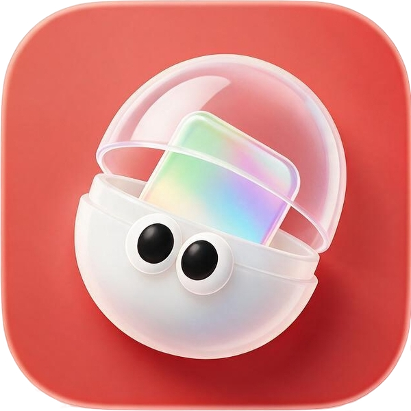
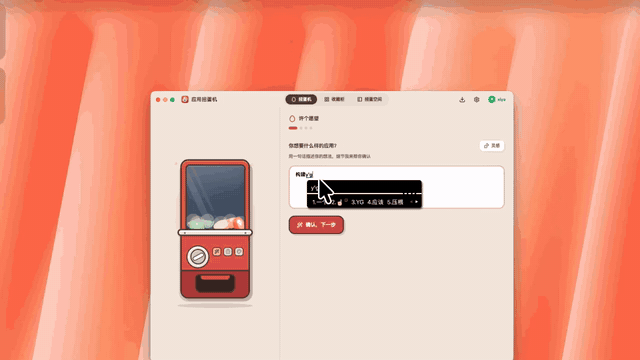
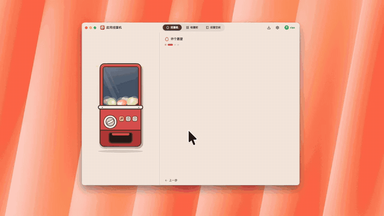
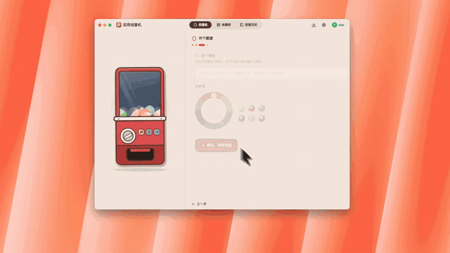

<p align="center">
  
</p>

<h1 align="center">AppGacha 应用扭蛋机</h1>
<h3 align="center">许愿即得、可迁移的桌面小应用</h3>

<p align="center">
  <a href="README.md">EN</a>
  &nbsp;·&nbsp;
  <a href="README.zh-CN.md">CN</a>
</p>

<p align="center">
  
  
  
  
  
  <a href="https://github.com/zaziax/appGacha/releases/latest"></a>
  
</p>

<p align="center">
  <a href="https://appgacha.com/#download"><strong>下载 AppGacha</strong></a>
  &nbsp;·&nbsp;
  <a href="https://github.com/zaziax/appGacha/releases">GitHub Releases</a>
</p>

---

## 这是什么？

AppGacha（应用扭蛋机）是一款 Electron 桌面应用。你用自然语言描述想要的应用，后台 AI 智能体管线自动生成一个完整、可运行、可迁移的桌面小应用——我们称之为「**扭蛋**」（`.gacha` 文件夹）。扭蛋在隔离沙箱中运行，拥有自己的数据库、文件系统和 AI 能力。把整个文件夹拷贝到另一台装了 AppGacha 的设备上，直接就能跑。

> 🥚 **什么是扭蛋？** 一个 `.gacha` 文件夹 = 一个完整的桌面应用。包含 `manifest.json`（身份 + 权限声明）、HTML/CSS/JS（功能实现）和 `data/`（持久数据）。纯 web 技术，零 Node.js 依赖，零构建步骤。迁移就是复制粘贴。

### 为什么叫"扭蛋"？

扭蛋隐喻天然设定了"结果有随机性、不满意可以再抽"的心理预期——这是产品决策，承认 AI 生成不完美，但用工程手段不断提高出蛋率。

## 下载

从 [appgacha.com](https://appgacha.com/#download) 或 [GitHub Releases](https://github.com/zaziax/appGacha/releases) 下载最新公开版本。

| 平台 | 支持范围 | 发布方式 |
|---|---|---|
| **Windows** | Windows 10/11，x64 | 安装包未签名，Windows SmartScreen 可能显示警告 |
| **macOS** | Apple 芯片（M1 或更新机型） | Developer ID 签名并通过 Apple 公证 |

不支持 Intel Mac，也暂无 Linux 支持计划。

## 本地优先

扭蛋及其数据默认保存在本地。已有扭蛋无需 AppGacha 账户即可在本机运行；主动使用 AI、云服务或局域网联机的能力仍需要对应连接。你既可以自带 OpenAI 兼容接口，也可以按需使用托管 AI、云同步和分享码等账户服务；`.gacha` 文件导入导出始终保留，不被云端锁定。

## 演示

从许愿到出蛋，三步走：

**1 · 许愿** — 一句话说出你想要的。



**2 · 确认细节** — AI 追问需求、挑风格。



**3 · 构建扭蛋** — 机芯生成 + 自动验收。



## 功能特性

### 对用户

- **愿望单** — 用自然语言描述你想要的应用，AI 会先问几个澄清问题再开始生成
- **收藏柜** — 所有扭蛋集中管理。3D 胶囊预览 + 呼吸浮动动画，一键打开，拖拽排序
- **扭蛋空间** — 把常用蛋固定到收藏柜内的多 tab 工作区，不占任务栏空间
- **Widget 形态** — 透明无边框、桌面置顶悬浮窗。番茄钟、便签、倒计时——真正的桌面存在感
- **局域网联机** — 蛋与蛋在同一局域网内自动发现，P2P 实时对战/协作/数据共享，无需服务器
- **系统托盘 + 定时通知** — 蛋可以注册 cron 定时提醒，关闭后依然触发。点击通知直接打开蛋
- **AI 自由选择** — 使用 AppGacha 托管 AI，或连接自己的 OpenAI 兼容模型服务与 API Key
- **可选云同步** — 需要跨设备便利时，可以选择将指定扭蛋同步到云端
- **分享码与可迁移文件** — 通过短期分享码让其他用户领取应用，也可以导出含数据或不含数据的 `.gacha` 文件；文件导入导出无需账户

### 对开发者

- **`.gacha` 开放规范** — 纯 HTML/CSS/JS（ES Module），零构建工具。任何人都能手写一颗蛋。详见 [egg-spec.md](docs/egg-spec.md)
- **Bridge API v1** — 9 个需授权的能力域 + 2 个免授权 UI 操作，全部异步，`egg.d.ts` 提供完整类型声明：

  | 域 | 权限 | API |
  |---|---|---|
  | AI | `ai` | `egg.ai.chat()` / `egg.ai.extract()` |
  | 数据库 | `db` | `egg.db.query()` / `egg.db.exec()`（SQLite） |
  | 存储 | `storage` | `egg.storage.get()` / `set()` / `delete()`（JSON KV） |
  | 文件 | `fs` | `egg.fs.read()` / `write()` / `list()` / `readBytes()` / `writeBytes()`（限 data/ 目录） |
  | 压缩 | `zip` | `egg.zip.create()` / `egg.zip.extract()` |
  | 通知 | `notify` | `egg.notify.send()` |
  | 定时 | `schedule` | `egg.schedule.set()` / `cancel()` / `list()`（cron，最多 20 条） |
  | 窗口 | `window` | `egg.window.setAlwaysOnTop()` / `setSize()` |
  | 联机 | `network` | `egg.net.createRoom()` / `findRooms()` / `joinRoom()` / `broadcast()` / `close()`（WebRTC P2P） |
  | UI（免授权） | — | `egg.ui.toast()` / `confirm()` / `pickFile()` / `saveFile()` / `pickBinary()` / `saveBinary()` |
  | 窗口控制（免授权） | — | `egg.minimize()` / `maximize()` / `close()` |

- **蛋模板 + 脚手架** — 智能体从模板起步，模板自带桌面应用壳设计系统（`base.css`）、Lucide 图标精灵图和预置 vendor ESM 库（无需网络）：

  | 分类 | 库 |
  |---|---|
  | 3D / 图形 | Three.js、p5.js、matter.js |
  | 图表 / 文档 | Chart.js、KaTeX、ExcelJS、pdfmake |
  | 工具类 | marked、qrcode、canvas-confetti、dayjs、anime.js、js-yaml、jsdiff、Tone.js |

- **双重验收** — `validate_egg`（静态检查：manifest schema、禁用 API 检测、emoji 禁令、外部 URL 检测、CSP 检测、JS 语法检查）→ `test_egg`（离屏运行 + 截图 + console 报错收集）。最多 3 轮修复循环

- **自研机芯** — `fcDriver` 提供 6 个工具（`list_files` / `read_file` / `read_guide` / `write_file` / `check_egg` / `finish`），SSE 流式 + 断流检测、上下文窗口压缩、预算护栏（60 回合 / 300k tokens / 15 分钟）

## 快速开始

### 前置要求

- **Node.js** ≥ 20
- **npm** ≥ 10
- **Windows 10/11 x64** 或 **Apple 芯片 macOS**

### 安装运行

```powershell
git clone https://github.com/zaziax/appGacha.git
cd appGacha
npm install
npm start              # 完整构建（tsc + vite）→ 启动 Electron（Windows）
npm run start:mac      # macOS
```

### 开发模式

```powershell
npm run dev:ui         # 终端一：Vite dev server（收藏柜热更新）
npm run dev            # 终端二：Electron 连 dev server
```

### 冒烟测试与金标愿望集

```powershell
npm run smoke          # 无头验收：蛋 bridge 全链路 + 收藏柜 + 失败/升级管线
npm run test           # 单元测试（Vitest）
npm run golden:fake    # 金标愿望回归——全链路出蛋→探针（假 AI）
npm run golden         # 金标愿望回归（真 AI）
```

### 打包

```powershell
npm run pack           # 未打包目录构建（Windows）
npm run dist           # 未签名 NSIS 安装程序（Windows x64）
npm run dist:mac       # 本地签名 + 公证的 DMG/ZIP（Apple 芯片 macOS）
```

`dist:mac` 需要 macOS 钥匙串中已有 Developer ID Application 证书，并在 `.env` 中配置 Apple 公证 API 凭据。命令只在 `release/` 生成本地产物，不会自动上传 GitHub。

### 国内网络镜像

```powershell
# Electron 二进制 — 手动下载后跳过 install.js 的下载步骤：
# https://npmmirror.com/mirrors/electron/37.2.0/electron-v37.2.0-win32-x64.zip

# better-sqlite3（需要 Electron ABI 136）— 下载对应版本解压覆盖：
# https://registry.npmmirror.com/-/binary/better-sqlite3/v<版本>/better-sqlite3-v<版本>-electron-v136-win32-x64.tar.gz
```

## 系统架构

```
┌────────────────── AppGacha (Electron) ───────────────────────────┐
│                                                                  │
│  ┌─────────────────┐  ┌─────────────────┐  ┌─────────────────┐  │
│  │  收藏柜 UI       │  │  扭蛋空间        │  │  独立蛋窗口      │  │
│  │  React + Vite    │  │  多 tab 视图     │  │  BrowserWindow  │  │
│  │                  │  │  WebContentsView │  │                  │  │
│  └────────┬─────────┘  └────────┬─────────┘  └────────┬─────────┘ │
│           │                     │                      │          │
│  ┌────────┴─────────────────────┴──────────────────────┴────────┐ │
│  │                    preload + Bridge API 能力层                 │ │
│  │  ai · db (SQLite) · storage · fs · zip · notify · schedule    │ │
│  │  window · network (WebRTC P2P) · ui (toast/对话框)            │ │
│  └───────────────────────────────────────────────────────────────┘ │
│                                                                  │
│  ┌────────────────┐  ┌────────────────┐  ┌───────────────────┐  │
│  │  扭蛋机芯       │  │  蛋管理器       │  │  账户              │  │
│  │  fcDriver       │  │  安装          │  │  Google OAuth     │  │
│  │  validate_egg   │  │  导出/导入     │  │  邮箱验证码登录    │  │
│  │  test_egg       │  │  升级          │  │                    │  │
│  │  pipeline       │  │  回滚          │  │                    │  │
│  └────────────────┘  └────────────────┘  └───────────────────┘  │
│                                                                  │
│  ┌────────────────┐  ┌────────────────┐  ┌───────────────────┐  │
│  │  定时调度       │  │  Widget 控制器  │  │  自动更新          │  │
│  │  cron 提醒      │  │  卫星控制窗     │  │  electron-updater │  │
│  │  点击通知打开   │  │  拖拽/固定/关闭 │  │  GitHub Releases  │  │
│  └────────────────┘  └────────────────┘  └───────────────────┘  │
└──────────────────────────────────────────────────────────────────┘
         │                                                   │
         ▼                                                   ▼
   ┌──────────┐                                  ┌──────────────────┐
   │  .gacha 目录│                                  │  AppGacha Server  │
   │  本地文件  │                                  │  FastAPI + PG 16  │
   └──────────┘                                  │  api.appgacha.com │
                                                 └──────────────────┘
```

### 扭蛋生成管线

```
愿望单（自然语言）
   │
   ▼
① 投币             从模板复制脚手架 → staging/<eggId>/
   │                管线写入受保护字段
   ▼
② 旋钮转动         fcDriver：自研 function calling 循环
   │                工具：list_files / read_file / read_guide /
   │                      write_file / check_egg / finish
   │                预算：60 回合 / 300k tokens / 15 分钟
   ▼
③ 机芯咔咔         validate_egg（静态检查）→
   │                test_egg（离屏运行 + 截图 + console 收集）
   │                不合格喂回智能体修复，上限 3 轮
   ▼
④ 咔哒！           通过 → 原子移入收藏柜 eggs/
                    超限 → 归档到 staging/failed/
```

### AI 模型通道

AppGacha 提供两条 AI 通道：通过可选账户服务使用托管 AI，或者自带 API Key 连接 DeepSeek、OpenAI、Kimi、Qwen 等 OpenAI 兼容服务。BYOK 凭据通过 Electron `safeStorage` 在设备上加密（Windows DPAPI / macOS Keychain），不会上传到 AppGacha。

## 项目结构

```
appGacha/
├── src/
│   ├── main/                    # Electron 主进程
│   │   ├── index.ts             #   入口、单实例锁、启动参数路由、退出同步
│   │   ├── pipeline.ts          #   扭蛋管线（投币→旋钮→咔咔→咔哒）
│   │   ├── fcDriver.ts          #   自研 function calling 循环（6 工具 + SSE + 上下文压缩）
│   │   ├── validate.ts          #   静态验收（schema、禁用 API、emoji、外部 URL、CSP、JS 语法）
│   │   ├── test.ts              #   运行时测试（离屏 + 截图 + console 收集）
│   │   ├── aiChannel.ts         #   托管 AI + BYOK 通道（safeStorage 加密凭据）
│   │   ├── auth.ts              #   Google OAuth + 邮箱验证码 + 密码登录，JWT 管理
│   │   ├── api.ts               #   统一 HTTP 客户端，自动 token 刷新
│   │   ├── eggs.ts              #   蛋注册表（发现、注册、移除、加载 manifest）
│   │   ├── eggWindow.ts         #   蛋窗口工厂（无边框、沙箱、独立 partition）
│   │   ├── eggDoc.ts            #   蛋结构快照（Markdown），供升级时 AI 快速理解蛋结构
│   │   ├── space.ts             #   扭蛋空间：WebContentsView 多 tab 工作区
│   │   ├── shelf.ts             #   IPC 注册聚合入口——re-export channels/ 各域注册器
│   │   ├── shelfWindow.ts       #   收藏柜窗口生命周期
│   │   ├── protocol.ts          #   egg:// 自定义协议 + session 断网锁定
│   │   ├── settings.ts          #   持久化设置（AI key、单蛋标记、分类、空间配置）
│   │   ├── gachaPkg.ts          #   .gacha ZIP 打包/解包 + 路径穿越防护
│   │   ├── schedule.ts          #   cron 定时提醒（cron-parser，每蛋最多 20 条）
│   │   ├── widgetControls.ts    #   Widget 卫星控制窗（拖拽把手/固定/关闭）
│   │   ├── widgetPlacement.ts   #   Widget 窗口位置持久化
│   │   ├── tray.ts              #   系统托盘图标 + 右键菜单
│   │   ├── menu.ts              #   macOS 最小原生菜单
│   │   ├── updater.ts           #   自动更新（electron-updater，GitHub Releases）
│   │   ├── smoke.ts             #   冒烟测试（bridge + 收藏柜 + 管线 + 升级）
│   │   ├── golden.ts            #   金标愿望集回归基准
│   │   ├── wishGuide.ts         #   愿望聊天的 AI prompt 组装
│   │   ├── assoc.ts             #   文件关联 + 协议注册（Windows）
│   │   ├── registry.ts          #   WebContents → egg 映射，权限检查依据
│   │   ├── log.ts               #   日志 + 崩溃报告
│   │   ├── i18n.ts              #   主进程 i18n（托盘菜单、窗口标题：zh/en）
│   │   ├── paths.ts             #   路径工具（dataRoot、appRoot）
│   │   ├── fsutil.ts            #   copyDir（规避 Node 22 fs.cpSync emoji 路径崩溃）
│   │   ├── ico.ts               #   ICO 编码，生成蛋专属图标
│   │   ├── channels/            #   收藏柜 IPC 注册器，按域拆分
│   │   │   ├── ipc.ts           #     共享 handle() 包装（发送者门控 + {ok,value}/{ok,error} 契约）
│   │   │   ├── eggChannels.ts   #     蛋 列表/打开/导入/导出/回收站/回滚
│   │   │   ├── gachaChannels.ts #     许愿/升级/取消/续跑 + wishChat AI
│   │   │   ├── settingsChannels.ts #  AI 设置 / 模型 / 应用设置 / 分类
│   │   │   ├── spaceChannels.ts #     空间 增/删/排序/激活/边界
│   │   │   ├── authChannels.ts  #     认证 状态/登录/登出/验证码/密码
│   │   │   ├── updateChannels.ts #    检查/状态/安装更新
│   │   │   └── windowChannels.ts #   窗口控制 + 状态事件
│   │   ├── capabilities/        #   Bridge API 能力实现
│   │   │   ├── index.ts         #     IPC handler 注册 + 权限校验
│   │   │   ├── storage.ts       #     JSON KV 存储（文件后端）
│   │   │   ├── db.ts            #     SQLite（better-sqlite3）
│   │   │   ├── dbGuard.ts       #     SQL 安全守卫（禁用危险 SQL、行数/字节上限）
│   │   │   ├── dbWorker.ts      #     SQLite worker 线程
│   │   │   ├── ai.ts            #     AI chat + extract（限速：20 次/分钟/蛋）
│   │   │   ├── fsx.ts           #     沙箱文件 I/O（仅 data/ 目录）
│   │   │   └── zip.ts           #     内存 ZIP 创建/解压
│   │   └── net/                 #   局域网联机（P2P WebRTC）
│   │       ├── coordinator.ts   #     房间管理（创建/加入/广播/关闭）
│   │       ├── discovery.ts     #     UDP 多播发现
│   │       ├── rtcHost.ts       #     隐藏 BrowserWindow 承载 WebRTC 连接
│   │       └── signaling.ts     #     信令协议
│   ├── preload/                 # preload 脚本（bridge 注入 + UI chrome）
│   │   ├── index.ts             #   桥接 API 暴露、标题栏注入、toast/confirm UI
│   │   └── shelf.ts             #   收藏柜专用 bridge
│   ├── shared/                  # 主进程 ↔ 渲染进程共享类型
│   └── ui/                      # 收藏柜 UI（React + Vite + Tailwind CSS）
│       ├── src/
│       │   ├── App.tsx          #   根组件：状态管理、i18n
│       │   ├── config/          #   常量配置（provider 图标）
│       │   ├── i18n/            #   i18next 资源（zh / en）
│       │   └── components/
│       │       ├── EggCard.tsx          # 蛋卡片（3D 胶囊）
│       │       ├── Capsule3D.tsx        # Three.js 扭蛋 3D 场景
│       │       ├── GachaMachine3D.tsx   # 3D 扭蛋机（许愿界面）
│       │       ├── GachaMachineV5.tsx   # 扭蛋机变体
│       │       ├── MachineView.tsx      # 扭蛋机视图布局
│       │       ├── GachaShowcase3D.tsx  # 3D 展示场景
│       │       ├── AppAssemblyStage.tsx # 应用装配进度台
│       │       ├── SpaceView.tsx        # 扭蛋空间多 tab 工作区
│       │       ├── ShelfToolbar.tsx     # 工具栏（搜索、筛选、设置）
│       │       ├── LoginDialog.tsx      # OAuth + 邮箱登录
│       │       ├── SettingsDialog.tsx   # AI key、应用偏好设置
│       │       ├── ExportDialog.tsx     # 导出 .gacha 文件
│       │       ├── UpdateDialog.tsx     # 更新提示 / 进度
│       │       ├── ConfirmDialog.tsx    # 风格化确认弹窗
│       │       ├── ClosePromptDialog.tsx # 关闭行为提示（托盘 vs 退出）
│       │       ├── ErrorBoundary.tsx    # 渲染错误边界
│       │       ├── Toast.tsx            # Toast 通知
│       │       ├── TitleBar.tsx         # 自定义无边框标题栏
│       │       └── UserPanel.tsx        # 用户账户面板
│       └── vite.config.ts
├── template/                    # 蛋模板（生成时复制到装配舱）
│   ├── manifest.json            #   占位 manifest
│   ├── index.html               #   入口 HTML 骨架
│   ├── app.js                   #   空白入口模块
│   ├── style.css                #   自定义样式占位
│   ├── base.css                 #   桌面应用壳设计系统（CSS 变量 + 组件 class）
│   ├── widget.css               #   Widget 形态样式
│   ├── widget.js                #   Widget 形态入口
│   ├── egg.d.ts                 #   Bridge API TypeScript 类型声明
│   ├── EGG_GUIDE.md             #   智能体必读手册：规则、布局、图标规范、vendor 库
│   ├── icons.svg                #   图标精灵图
│   ├── icons-manifest.json      #   可用图标名清单
│   ├── vendor/                  #   预置 ESM 库（无需网络）
│   │   ├── three.module.js      #     Three.js
│   │   ├── chart.esm.js         #     Chart.js
│   │   ├── marked.esm.js        #     Markdown 解析
│   │   ├── qrcode.esm.js        #     二维码生成
│   │   ├── canvas-confetti.esm.js #   庆祝撒花特效
│   │   ├── dayjs.esm.js         #     日期工具
│   │   ├── anime.esm.js         #     Anime.js
│   │   ├── jsyaml.esm.js        #     YAML 解析
│   │   ├── p5.esm.js            #     p5.js
│   │   ├── katex.esm.js         #     KaTeX 数学渲染
│   │   ├── exceljs.esm.js       #     ExcelJS
│   │   ├── math.esm.js          #     Math.js
│   │   ├── pdfmake.esm.js       #     pdfmake
│   │   ├── jsdiff.esm.js        #     文本 diff
│   │   ├── matter.esm.js        #     Matter.js 物理引擎
│   │   └── tone.esm.js          #     Tone.js 音频
│   └── guides/                  #   专题指南（read_guide 工具加载）
│       └── net-lan/             #     局域网联机模式指南（给 AI 智能体参考）
├── assets/                      # 应用图标 + 静态资源
├── docs/                        # 设计文档
│   ├── design.md                #   设计总览与决策记录（D1–D10）
│   ├── egg-spec.md              #   .gacha 格式规范 & Bridge API
│   ├── gacha-core.md            #   扭蛋机芯设计
│   ├── runtime.md               #   蛋运行时：沙箱、协议、安全
│   ├── desktop-value.md         #   桌面差异化价值纲领
│   ├── server-architecture.md   #   服务端架构方案（不开源）
│   ├── threat-model.md          #   安全威胁模型与缓解措施
│   ├── vendor-roadmap.md        #   Vendor 库路线图
│   └── project-assessment-report.md # 项目评估报告
├── package.json
└── LICENSE
```

## 技术栈

| 层 | 技术 |
|---|---|
| 桌面框架 | Electron 37 |
| 收藏柜 UI | React 19 + TypeScript 5.5 + Vite 8 + Tailwind CSS 4 |
| 3D 渲染 | Three.js + @react-three/fiber + @react-three/drei |
| 动画 | Motion (Framer Motion) |
| 本地数据库 | better-sqlite3 |
| 国际化 | i18next + react-i18next |
| Cron 解析 | cron-parser |
| 打包压缩 | yazl + yauzl（ZIP） |
| 测试 | Vitest |
| 自动更新 | electron-updater |
| 图标 | Lucide React |
| 服务端（不开源） | Python FastAPI + PostgreSQL 16 + Docker Compose |

## 窗口类型

扭蛋在 `manifest.json` 的 `window.type` 字段声明窗口形态。manifest 支持两种值：

| 类型 | 说明 | 标题栏 | 适用场景 |
|---|---|---|---|
| **standard** | 无边框窗口，自动注入自定义标题栏 | ✅ 自动注入 | 大多数扭蛋 |
| **widget** | 透明无边框置顶，独立卫星控制窗（拖拽/固定/关闭） | ❌ 无 | 番茄钟、便签、时钟 |

此外，固定到**扭蛋空间**的蛋以内嵌 `WebContentsView` 形式渲染在收藏柜窗口内——这是宿主级功能，不是 manifest 的 `window.type` 值。

## 路线图

| 里程碑 | 状态 | 说明 |
|---|---|---|
| **M1** 蛋运行时 | ✅ 完成 | egg:// 协议、沙箱窗口、权限模型、样例蛋 |
| **M2** 能力层 + 收藏柜 | ✅ 完成 | 9 个 bridge 能力域、收藏柜基础 UI、模型配置（BYOK） |
| **M3** 扭蛋机芯 | ✅ 完成 | 自研 fcDriver、双重验收、实况进度、后台挂起 |
| **M3.5** 许愿升级 | ✅ 完成 | 整蛋备份、增量进化、数据迁移、原子换装、回滚 |
| **M4** 收藏柜化妆 | ✅ 完成 | 3D 扭蛋机（第四代）、弹簧动画、HSL 色相环、拖拽排序、音效系统、i18n（zh/en，各 344 key） |
| **M5** 金标愿望集 | ✅ 完成 | 金标愿望回归基准——按应用形态 × 能力域 × 难度三轴抽样的代表性愿望，每条带探针达标线 |
| **M6** 跨平台 | ✅ 完成 | Windows x64 + Apple 芯片 macOS（无 Intel Mac 或 Linux 计划） |

## 文档

| 文档 | 说明 |
|---|---|
| [设计总览与决策记录](docs/design.md) | 架构决策、取舍、D1–D10 决策记录 |
| [.gacha 格式规范 & Bridge API](docs/egg-spec.md) | 全系统的契约锚点——运行时、生成器、管理器均以此为准 |
| [蛋运行时技术方案](docs/runtime.md) | 沙箱隔离、egg:// 协议、权限执行 |
| [扭蛋机芯设计](docs/gacha-core.md) | 生成管线、fcDriver、验收工具 |
| [桌面差异化价值纲领](docs/desktop-value.md) | 产品方向：为什么桌面原生是壁垒 |
| [服务端架构方案](docs/server-architecture.md) | 后端设计（不开源） |
| [安全威胁模型](docs/threat-model.md) | 安全威胁模型与缓解措施 |
| [Vendor 库路线图](docs/vendor-roadmap.md) | 预置 vendor 库路线图 |
| [项目评估报告](docs/project-assessment-report.md) | 项目评估报告 |

## FAQ

<details>
<summary><b>为什么用独立 BrowserWindow 而不是 iframe/webview？</b></summary>

独立窗口让每个蛋拥有自己的任务栏图标、Alt-Tab 切换和窗口控制——这是"真正的桌面应用"承诺。独立渲染进程提供了天然的进程隔离。详见 [runtime.md](docs/runtime.md)。
</details>

<details>
<summary><b>为什么自研 function calling 循环，不用现成 Agent SDK？</b></summary>

产品硬约束：一切能力必须自包含，不能要求用户预装任何运行时。Agent SDK 依赖本机 Node/CLI 环境。自研 `fcDriver` 完全在主进程内运行。详见 [design.md D2'](docs/design.md#d2-修订自研微型机芯自建-function-calling-循环agent-sdk-出局)。
</details>

<details>
<summary><b>扭蛋能访问网络吗？</b></summary>

默认不能。每颗蛋的 session 加载后即被锁定——仅允许 `egg://` 协议和 bridge API 通信，外部 HTTP 请求全部拦截。Vendor 库（`template/vendor/`）已预先内置，蛋可以直接 import Three.js、Chart.js 等无需联网。
</details>

<details>
<summary><b>如何手写一颗扭蛋？</b></summary>

参照 [egg-spec.md](docs/egg-spec.md)。简版：创建 `my-app.gacha/` 文件夹 → 编写 `manifest.json`（声明权限）→ 编写 `index.html`（使用 `egg.*` bridge API）→ 放入 eggs 目录即用。零构建工具。
</details>

<details>
<summary><b>支持哪些 AI 模型？</b></summary>

任何 OpenAI 兼容接口均可：DeepSeek、Kimi、Qwen、GPT-4 等。在设置中配置 base URL + 模型名 + API Key。
</details>

## 贡献

欢迎贡献。项目处于早期阶段，重点关注：

- 🐛 Bug 报告与修复
- 📝 文档改进
- 🧪 金标愿望集（回归测试标准用例）
- 🌐 国际化贡献
- 🎨 蛋模板与 `base.css` 设计系统

请先开 Issue 讨论再提交 PR。

## 许可证

[MIT](LICENSE)

---

<p align="center">
  <sub>Made with 🥚 by AppGacha</sub>
</p>
