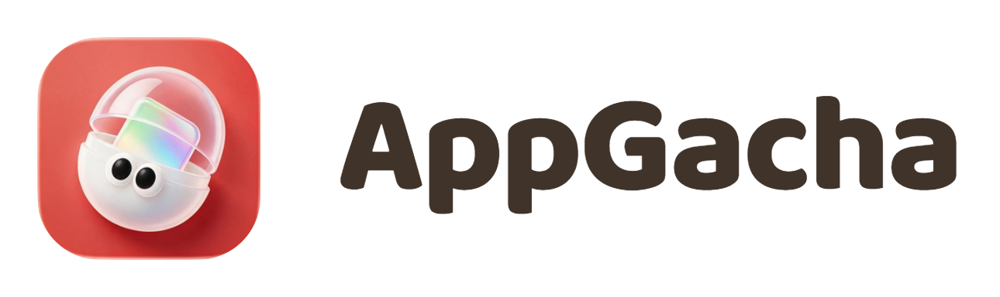
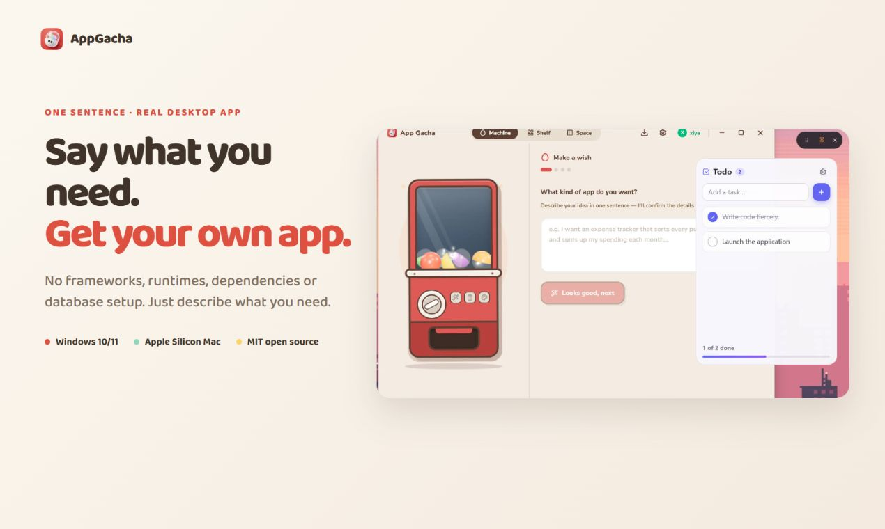
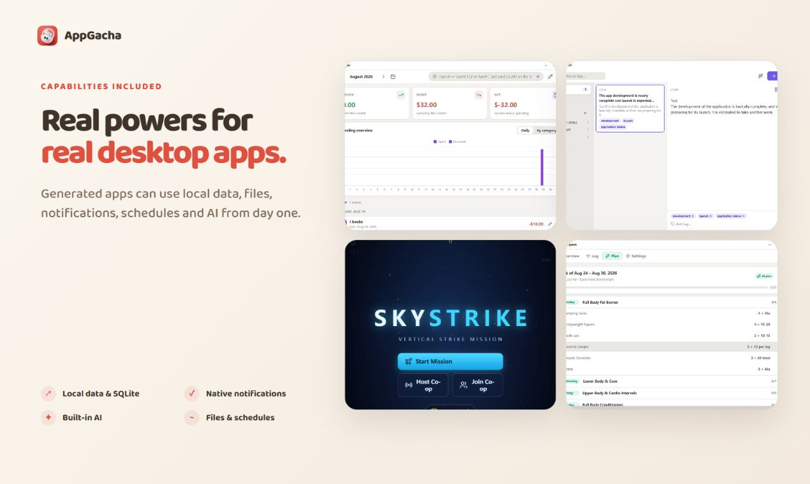
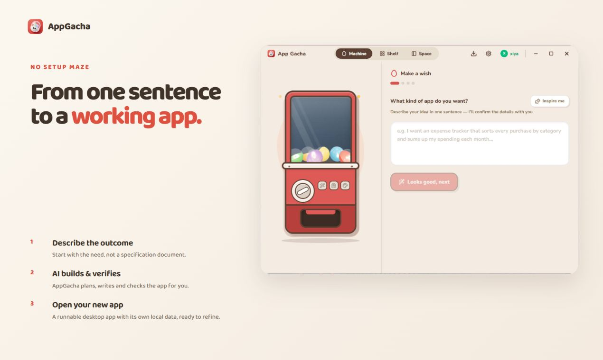
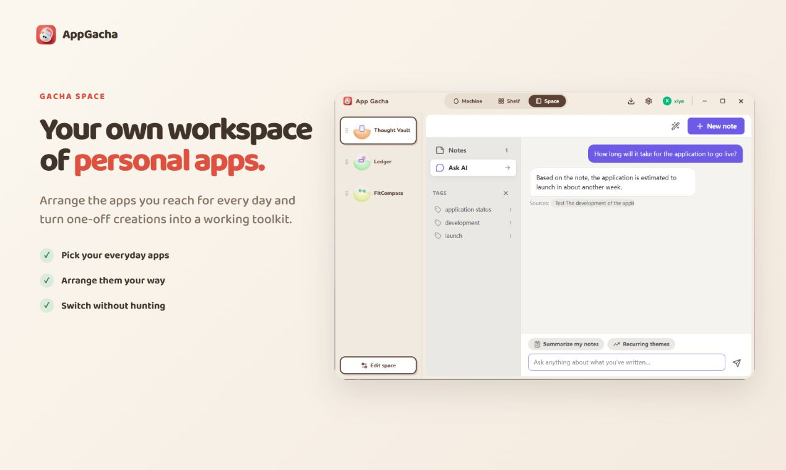
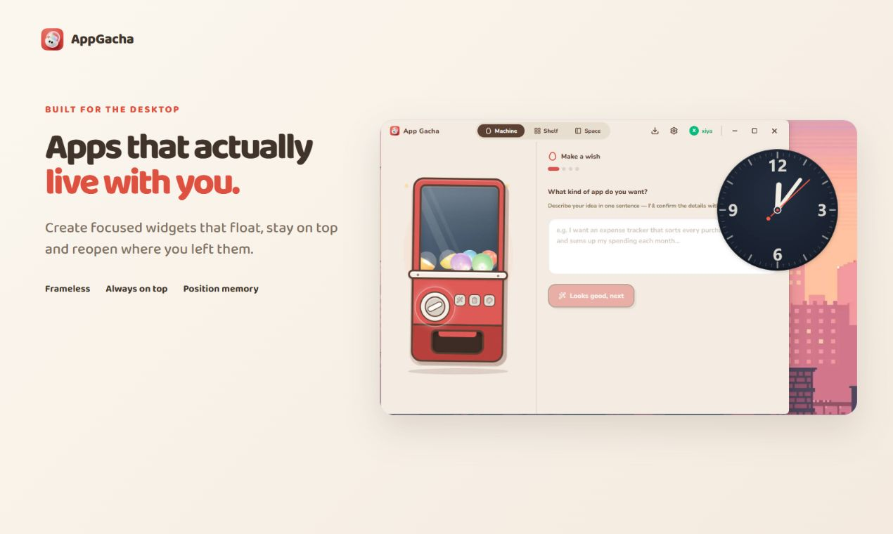
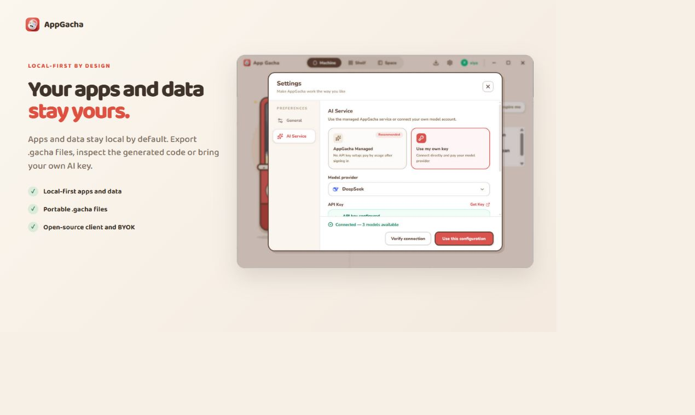

<p align="center">
  <picture>
    <source media="(prefers-color-scheme: dark)" srcset="assets/readme/appgacha-wordmark-dark.png" />
    
  </picture>
</p>

<h3 align="center">一句话，扭出属于你的桌面小应用。</h3>

<p align="center">
  面向 Windows 和 macOS 的开源 AI 应用构建工具。<br />
  描述想法，打开扭蛋，让它成为日常的一部分。
</p>

<p align="center">
  <a href="README.md">English</a> · <a href="README.zh-CN.md">简体中文</a>
</p>

<p align="center">
  <a href="https://github.com/zaziax/appGacha/releases/latest"></a>
  <a href="LICENSE"></a>
  
  
</p>

<p align="center">
  
  
  
  
  
  
</p>

<p align="center">
  <a href="https://appgacha.com/#download"><strong>下载 AppGacha</strong></a> ·
  <a href="https://github.com/zaziax/appGacha/releases">版本发布</a> ·
  <a href="docs/mcp.md">连接 MCP</a> ·
  <a href="https://github.com/zaziax/appGacha/issues">反馈问题</a>
</p>



<p align="center">
  <a href="https://youtu.be/IcDF_kpP8BM"><strong>在 YouTube 观看产品宣传片 →</strong></a><br />
  <sub>通过动画，看看一个想法如何变成桌面应用，融入你的工作空间。</sub>
</p>

## 为你自己的日常，做一点小工具

符合你习惯的记事本，留在桌面上的计时器，个人记账工具、运动记录，或者一个小游戏。

AppGacha 把自然语言需求变成一颗**扭蛋**：由 HTML/CSS/JavaScript 构成的小应用，在 AppGacha 的桌面运行环境中使用，并保存自己的本地数据。使用下载安装的 AppGacha，不需要准备开发环境。

- **描述需求即可开始。** 确认细节，让 AI 创建并检查应用。
- **真正用在桌面上。** 从快捷方式打开应用，或使用无边框、可置顶的桌面组件。
- **把常用工具放在一起。** 在收藏柜管理扭蛋，在 GachaSpace 工作空间切换使用。
- **保留控制权。** 查看生成的代码、导出扭蛋，也可以使用自己的 OpenAI 兼容 API Key。
- **让其它智能体来构建。** 通过本地 MCP 连接，把创建扭蛋融入你已有的智能体工作流。



> 扭蛋需要 AppGacha 才能运行，不是独立安装包。AI 生成的应用可能需要进一步修改，自动检查通过也不代表所有使用场景都已验证。

## 开始使用

### 1. 下载应用

从 [appgacha.com](https://appgacha.com/#download) 或 [GitHub Releases](https://github.com/zaziax/appGacha/releases/latest) 下载最新版本。

| 平台 | 支持范围 | 安装说明 |
|---|---|---|
| Windows | Windows 10/11，x64 | 安装包未签名，SmartScreen 可能显示警告 |
| macOS | Apple 芯片（M1 或更新机型） | Developer ID 签名并通过 Apple 公证 |

目前不支持 Intel Mac 和 Linux。

### 2. 选择 AI 服务

在设置中填写 **OpenAI 兼容服务**的接口地址、模型名称和 API Key；也可以登录账号，使用可选的托管 AI。

自带密钥（BYOK）无需注册 AppGacha 账号或订阅，但模型服务商仍可能收取调用费用。托管 AI 和可选云服务需要账号。

### 3. 许一个愿望

从一个具体的小需求开始，例如：

> 做一个运动记录工具，可以添加训练动作、记录组数和次数，并查看以前的训练记录。

回答需求澄清问题，等待 AppGacha 构建和检查，再从收藏柜打开扭蛋。试用核心功能，有不合适的地方可以继续提出修改。

<details>
<summary>展开查看创建流程</summary>



**描述 → 确认 → 构建。** 以下动图展示应用内的操作流程；实际生成时间随需求和模型而变化。


</details>

## 把常用的小应用，放进自己的工作空间

在 **GachaSpace** 中集中使用笔记、记账和个人工具。选择应用，排列侧栏，点击切换，不必在多个窗口之间来回寻找。



<details>
<summary>展开查看桌面组件与本地优先设计</summary>

把需要常看的工具变成无边框、可置顶的桌面组件。



扭蛋与数据默认保存在本地，需要迁移或分享时再导出。



</details>

## 使用自己的智能体创建扭蛋

**实验功能，0.1.2 起可用。** AppGacha 可以作为本地 MCP 服务：外部智能体负责编写应用，AppGacha 提供模板、API 规范、检查、预览，以及添加到收藏柜的能力。

1. 打开 **设置 → 外部智能体**，启用本地 MCP。
2. 创建连接，将配置复制到支持启动本地 **stdio MCP** 服务的客户端。
3. 保持 AppGacha 运行，让智能体创建、检查并安装新的扭蛋。

这条路径不消耗 AppGacha 内置生成积分。外部模型服务可能计费；成品扭蛋内部使用的 AI 功能仍遵循 AppGacha 中的 AI 配置。

MCP 默认关闭。连接密钥需要保密；此服务不开放已有扭蛋的私有数据或 API 密钥。

[查看连接方法、限制和安全边界 →](docs/mcp.md)

## 应用和数据，仍然属于你

扭蛋的工作目录以 `.gacha` 结尾，包含清单、应用代码和持久数据。导出时可以打包为一个 `.gacha` 文件，并选择是否携带数据。

- **默认本地保存。** 已有扭蛋无需 AppGacha 账号即可运行；AI、云服务和局域网功能仍需要相应连接。
- **自主选择 AI。** BYOK 凭据在设备上加密保存，不上传到 AppGacha。
- **可以迁移。** 文件导入导出不需要账号；目标设备需要安装 AppGacha。
- **云端按需使用。** 托管 AI、云同步和分享码都是可选服务。桌面客户端采用 MIT 许可证，托管后端不开源。
- **自选存储位置。** 可以在设置中选择扭蛋目录，具体见[存储与迁移说明](docs/egg-storage.md)。

## 开发与文档

桌面客户端基于 **Electron、React 和 TypeScript**。扭蛋使用普通 HTML/CSS/JavaScript，通过受权限约束的桥接 API 使用本地存储、SQLite、文件、AI、通知等能力。

```sh
git clone https://github.com/zaziax/appGacha.git
cd appGacha
npm install
```

Windows 使用 `npm start`，macOS 使用 `npm run start:mac`。开发需要 Node.js 20+ 和 npm 10+；普通用户直接下载上方的安装包即可。

| 文档 | 内容 |
|---|---|
| [开发指南](docs/development.zh-CN.md) | 构建、测试、打包、架构与源码目录 |
| [扭蛋格式规范](docs/egg-spec.md) | 清单、权限和桥接 API |
| [MCP 指南](docs/mcp.md) | 外部智能体创建扭蛋与连接配置 |
| [生成质量设计](docs/generation-quality.md) | 构建、验证与修复流程 |
| [运行时](docs/runtime.md) · [安全边界](docs/threat-model.md) | 隔离机制与能力边界 |
| [发布前手动测试清单](docs/release-manual-checklist.md) | 安装包与跨平台验证 |

## 参与贡献

欢迎提交问题反馈、真实的扭蛋需求、文档改进、翻译与代码贡献。较大的修改请先通过 [Issue](https://github.com/zaziax/appGacha/issues) 讨论。

反馈构建失败时，请附上 AppGacha 版本、操作系统、服务商与模型名称，以及复现步骤。分享日志前，请移除 API 密钥、令牌和私人数据。

## 许可证

[MIT](LICENSE)。
